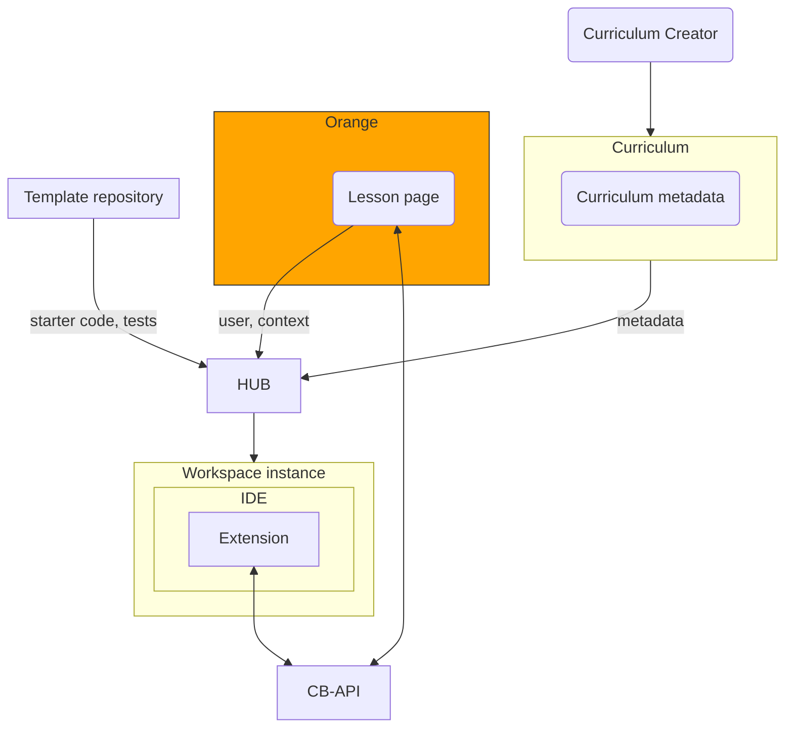

# Toolkit-flowcharts

```mermaid
flowchart TB
  
  subgraph Orange
    Lesson(Lesson page)
  end
  
  subgraph Workspace [Workspace instance]
    subgraph IDE
      Extension
    end
  end
  
  subgraph Curriculum
    id1(Curriculum metadata)
  end

  subgraph Templates [Template repository]
  end
  
  Creator(Curriculum Creator) --> Curriculum
  Extension <--> CB-API
  Lesson --> |user, context| HUB
  Lesson <--> CB-API
  HUB --> Workspace
  Curriculum --> |metadata| HUB
  Templates --> |starter code, tests| HUB
  
  style Orange fill:#FFA500,stroke:#333
```

[Mermaid basic syntax](https://mermaid-js.github.io/mermaid/#/flowchart)
[Live flowchart editor](https://mermaid-js.github.io/mermaid-live-editor/)
